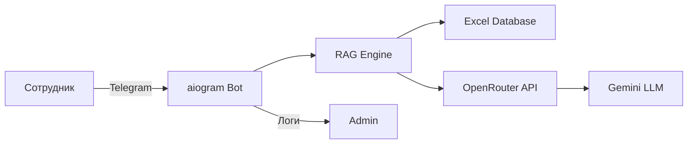

# HR-Assistant Telegram Bot — Описание проекта

## Обзор

**HR-Assistant** — корпоративный Telegram-бот для автоматизации ответов на вопросы сотрудников по регламентам, процедурам и политикам компании. Бот использует технологию RAG (Retrieval-Augmented Generation) для поиска релевантной информации в базе знаний (Excel-файл) и генерации ответов с помощью LLM (Gemini через OpenRouter).

---

## Архитектура



---

## Стек технологий

| Компонент | Технология | Версия |
|-----------|------------|--------|
| Telegram Bot Framework | aiogram | 3.x |
| LLM Provider | OpenRouter (Gemini 2.0 Flash) | API |
| Data Storage | Excel (pandas + openpyxl) | — |
| Hosting | Railway.app | — |
| Language | Python | 3.11 |

---

## Структура проекта

```
HR-бот/
├── main.py           # Точка входа, обработчики Telegram
├── rag_engine.py     # Логика RAG: загрузка данных, запросы к LLM
├── config.py         # Конфигурация и переменные окружения
├── database.xlsx     # База знаний (Excel)
├── requirements.txt  # Зависимости Python
├── Procfile          # Конфигурация Railway (worker process)
├── runtime.txt       # Версия Python для Railway
├── .gitignore        # Исключения для Git
└── .env.example      # Шаблон переменных окружения
```

---

## Ключевые файлы

### `main.py` (54 строки)
- Инициализация бота и диспетчера aiogram
- Обработчик `/start` — приветственное сообщение
- Обработчик текстовых сообщений — вызов RAG Engine
- Логирование запросов администратору
- Fallback на plain text при ошибках Markdown

### `rag_engine.py` (81 строка)
- Загрузка всех листов Excel в единый текстовый контекст
- Глобальный кэш базы знаний (загружается один раз)
- Формирование промпта с инструкциями для LLM
- Вызов OpenRouter API (Gemini)

### `config.py` (18 строк)
- Загрузка переменных окружения через `python-dotenv`
- Константы: пути к файлам, API-ключи, ID администратора

---

## Переменные окружения

| Переменная | Описание | Обязательна |
|------------|----------|-------------|
| `TELEGRAM_BOT_TOKEN` | Токен от BotFather | ✅ |
| `OPENROUTER_API_KEY` | API-ключ OpenRouter | ✅ |
| `ADMIN_ID` | Telegram ID администратора для логов | ⚠️ Рекомендуется |
| `OPENROUTER_MODEL` | Модель LLM (по умолчанию: `google/gemini-2.0-flash-thinking-preview:free`) | ❌ |

---

## Текущие возможности

- ✅ Ответы на вопросы по базе знаний
- ✅ Поддержка всех листов Excel-файла
- ✅ Логирование запросов администратору
- ✅ Fallback при ошибках форматирования
- ✅ Деплой на Railway

---

## Текущие ограничения

- ⚠️ Синхронный вызов LLM (блокирует обработку других сообщений)
- ⚠️ Глобальный кэш не обновляется без перезапуска
- ⚠️ Нет rate limiting
- ⚠️ Нет метрик и мониторинга
- ⚠️ Нет персистентного хранения логов
